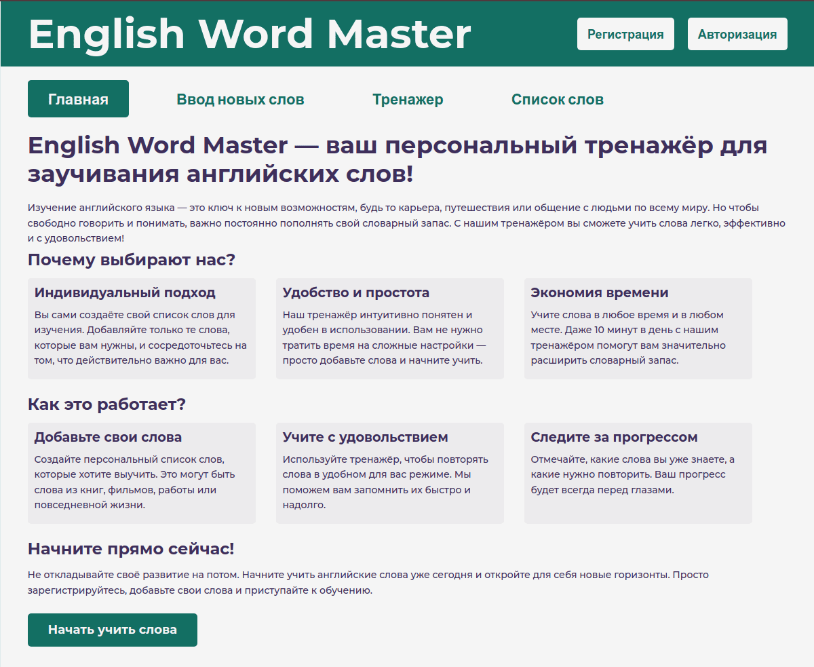
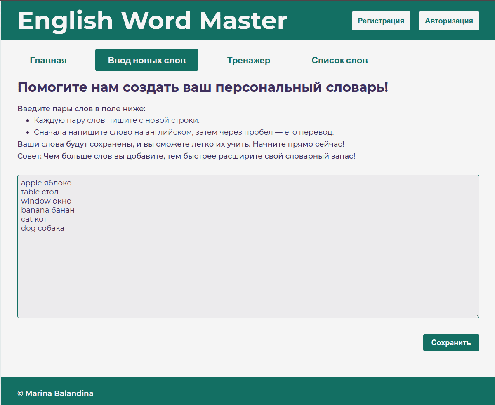
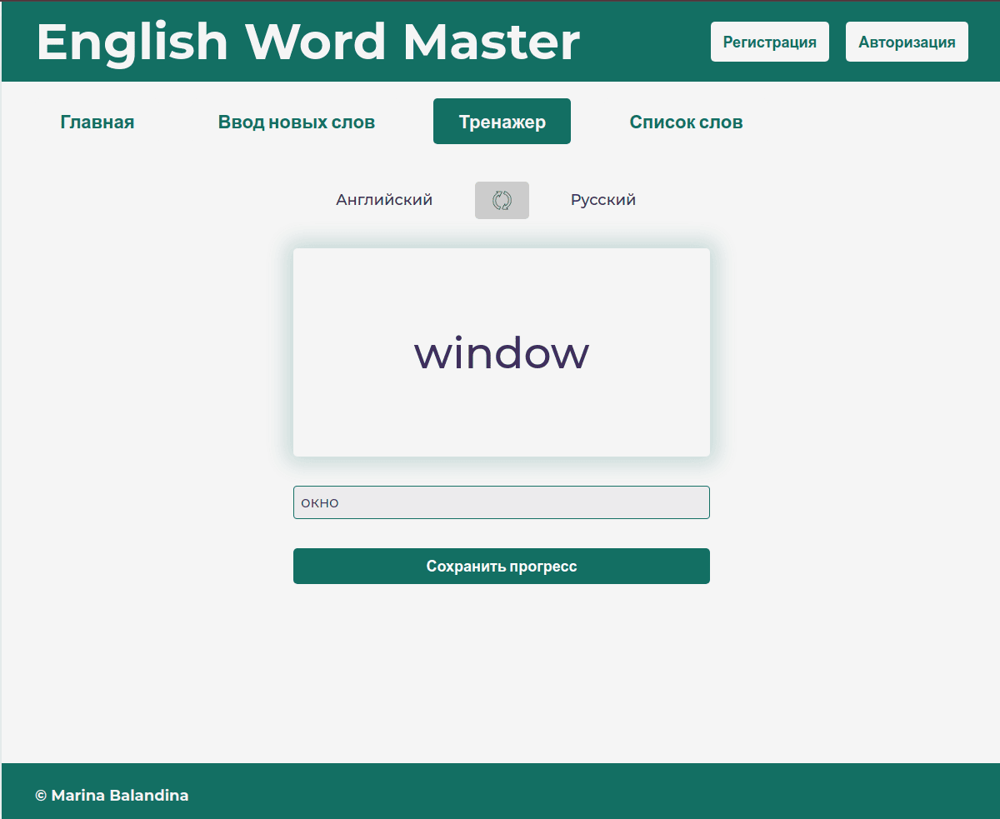
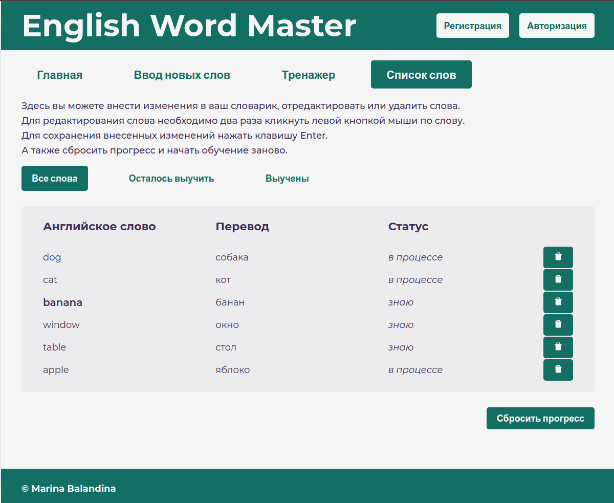
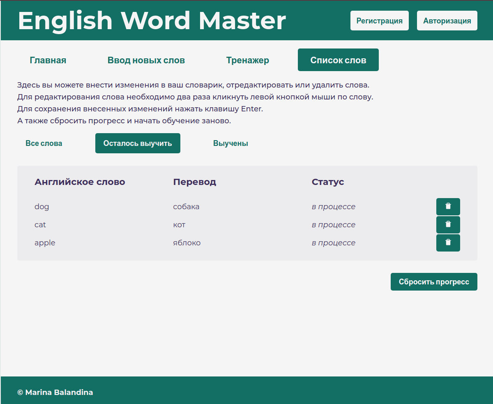

# 📚 English Word Master

[](https://balandinam.github.io/Simulator/)
[](https://github.com/BalandinaM/Simulator)

Интерактивный тренажер для запоминания английских слов с системой повторения и персональным словарем.

## ✨ Особенности
- 📝 Добавление слов парами (английский ↔ русский)
- 🔁 Два режима тренировки (EN→RU и RU→EN)
- 📊 Система повторения (алгоритм интервальных повторений)
- ✏️ Редактирование и фильтрация словаря
- 💾 Локальное сохранение прогресса (LocalForage)

## 🛠 Технологии
- **Frontend**: React 19 + Vite
- **State Management**: Redux Toolkit + Immer
- **Forms**: Formik + Yup
- **Routing**: React Router
- **Storage**: LocalForage
- **Деплой**: GitHub Pages

## 🚀 Запуск
1. Установите зависимости:

```npm install```

2. Запустите dev-сервер:

```npm run dev```

### Для production-сборки:

```npm run build```


## 📸 Скриншоты

| Описание | Скриншот |
|----------|----------|
| **Главный экран** |  |
| **Ввод новых слов** |  |
| **Режим тренажера** |  |
| **Список слов** |  |
| **Фильтрация слов** |  |
| **Редактирование** |  |


## 📌 Планы по развитию

- Добавить авторизацию и синхронизацию между устройствами
- Адаптация интерфейса под смартфоны и планшеты
